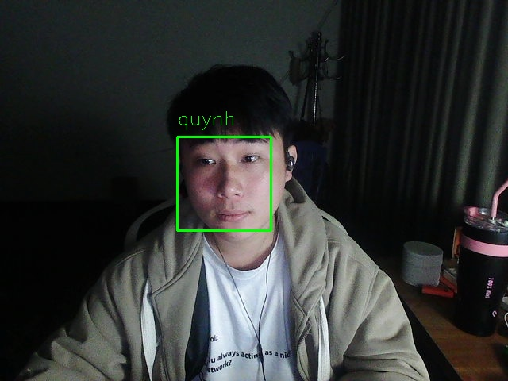

Trong các bài trước chúng ta đã tìm hiểu về face recognition. Hôm này chúng ta sẽ đi nhận diện khuôn mặt trong ảnh và video với OpenCV, Python và Deep Learning (thư viện chính là `face_recognition`)

Thư viện `dlib` chứa implementation của "deep learning metric" được sử dụng để xây dựng facial embeddings (cái này sẽ dùng để thực hiện face recognition).

Thư viện `face_recognition` hỗ trợ tốt cho các hàm trong `dlib` giúp chúng ta làm việc dễ hơn. 
Cài đặt các thư viện như sau:
```python
pip install dlib
pip install face_recognition
```
Nên nhớ ở đây chúng ta **sử dụng lại pre-trained model - tạo ra embedding 128 dimensions** chứ không training lại từ đầu (model này đã được train với rất nhiều ảnh rồi).

### Bố cục chung

Project sẽ có một số thư mục như sau:

* `venv`: Đây là môi trường ảo cho dự án, nơi các thư viện (như các thư viện Python) được cài đặt để tránh xung đột với các dự án khác. Thư mục này thường bị ẩn mặc định.
* `config`: Thư mục này có thể chứa các tệp cấu hình cho dự án, chẳng hạn như cài đặt cho các thư viện hoặc các tham số cho mô hình nhận diện khuôn mặt.
* `data`: Thư mục này có thể chứa dữ liệu thô được sử dụng để huấn luyện hoặc kiểm tra hệ thống nhận diện khuôn mặt, ví dụ như hình ảnh hoặc các bộ dữ liệu khác.
* `dlib`: Thư mục này có thể liên quan đến thư viện dlib hoặc các tệp liên quan. Dlib là một thư viện học máy phổ biến được sử dụng trong nhận diện khuôn mặt và phát hiện đối tượng.
* `json`: Thư mục này có thể chứa các tệp JSON, dùng để lưu trữ dữ liệu theo định dạng cấu trúc, chẳng hạn như metadata, cấu hình hoặc thông tin về mô hình.
* `myenv`: Đây có thể là một môi trường ảo khác hoặc là thư mục chứa cấu hình hoặc tập lệnh riêng cho người dùng.
* `src`: Thư mục này chứa mã nguồn của dự án. Bên trong thư mục này có thể có các thư mục con cho các phần khác nhau của mã nguồn.

* `Build_data`: Thư mục này có thể chứa các tập lệnh để chuẩn bị hoặc tiền xử lý dữ liệu trước khi sử dụng trong mô hình.

* `encode_face`: Thư mục này có thể chứa các tập lệnh hoặc hàm để mã hóa đặc điểm khuôn mặt, chuyển khuôn mặt thành các đại diện số để sử dụng trong nhận diện.

* `recognize_face`: Thư mục này có thể chứa mã nguồn thực hiện thuật toán nhận diện khuôn mặt hoặc mô hình nhận diện, xử lý các khuôn mặt đã được mã hóa để xác định hoặc so khớp chúng.

### Bước1. Tạo dataset 
* Ở đây chúng ta sử dụng `build_data.py` để xây dựng dataset. Trong thư mục `src/Build_data` có chứa các subdirctory cho từng người với tên (+ ID nếu cần), trong mỗi subdirectory lại chứa ảnh khuôn mặt của người đó.

> **Chú ý:** Mỗi ảnh nên chỉ chứa duy nhất 1 khuôn mặt của người đó (nếu có các khuôn mặt của nhiều người, phần implementation bên dưới sẽ phức tạp hơn vì đôi khi phải xác định thêm ai trong bức ảnh)

* Ở đây dataset được tạo thông qua webcam. Đưa mặt người đến gần, xa webcam, với các tư thế, biểu cảm khác nhau. Chạy file `build_dataset.py` rồi nhấn phím `k` để lưu ảnh của từng người. Đối với mỗi người nên có ít nhất 10-20 ảnh để mô hình có độ chính xác cao. Trong file này mình không thêm bộ phát hiện khuôn mặt vào ví dụ **Haar cascades** hoặc kẻ khung để người dùng điều chỉnh mặt trong đó. Ở đây mình muốn mô hình nhận được ảnh chứa khuôn mặt với nhiều điều kiện khác nhau để mô hình có thể hoạt động tốt hơn trong thực tế (lưu thêm nhiều ảnh cho nhiều điều kiện).

Ngoài việc tạo dataset thông qua webcam, chúng ta có thể tạo dataset thủ công hoặc sử dụng Search API như Bing hay Google.
Sau khi dataset được tạo với `build_dataset.py` chúng ta sẽ chạy `encode_faces.py` để tạo các embeddings.

### Bước 2. Tạo encodings cho các khuôn mặt trong dataset
* Sau khi tạo xong dataset chúng ta sẽ đi tạo các encodings (hay embeddings) của các khuôn mặt trong dataset đó. Việc đầu tiên cần làm là đi trích xuất các face ROIs (tránh sử dụng hết cả ảnh vì sẽ có nhiều nhiễu background ảnh hưởng đến chất lượng mô hình). Để phát hiện và trích xuất khuôn mặt có thể sử dụng nhiều phương pháp như haar cascades, HOG + Linear SVM, Deep Learning-bases face detector... Khi có các face ROIs chúng ta sẽ đưa chúng qua mạng NN để lấy các encodings.


*Tạo encoding từ ảnh khuôn mặt*

* Ở đây chúng ta không training lại từ đầu mạng tạo encodings mà sử dụng lại pre-trained model (trong thư viện `dlib` và được tích hợp vào `face_recognition` để dễ sử dụng hơn) nhằm tạo ra các face embeddings.

* Trong phần này file `encode_faces.py` được chạy để lưu các encodings và names (nếu cần ID thì bổ sung). Các bạn xem thêm file đó để hiểu hơn, mình có chú thích rất rõ từng phần. Các encodings và names được lưu ra file `encodings.pickle`.

### Bước 3. Nhận dạng khuôn mặt trong ảnh và trích xuất thông tin từ trên firebase về


*Ảnh đầu ra sau khi nhận diện*

* Sau khi chúng ta đã có các encodings từ datasets (lấy được qua pre-trained model, thông qua dlib và face_recognition) chúng ta có thể bắt đầu thực hiện face recognition được rồi.

* Chạy file `recognize_faces_image.py` để nhận diện khuôn mặt trong ảnh, đối với video thì các bạn chạy file`recognize_faces_video.py`.

**Chú ý:**
* Nếu muốn chạy face recognition trên **CPU** hay các thiết bị nhúng như **Raspberry** thì chọn detection method là `hog` ở file `recognize_faces_image.py`, còn ban đầu khi lấy encodings từ dataset chúng ta vẫn có thể để `cnn` (chạy lâu hơn nhưng chính xác hơn để phát hiện khuôn mặt). 

* Phần Json đang thiếu file dùng để kết nối tới firebase.Nếu bạn có lấy về vui lòng lên firebase của mình lấy key.
`Hướng dẫn lấy key`
```python
Bước 1: Vào firebase,sau đó tạo project nào mà bạn muốn dùng
Bước 2: Vào phần project Settings-Servies Accounts-Tại đây ta tiến hành chọn `Generate new private key`, rồi cửa sổ hiện lên thì chọn `Generate key`
Bước 3: Sau khi tải về thì tiến hành đổi tên thành `serviesAcc.json` rồi đưa nó vào file có tên là json

```

### Kết luận
Như vậy chúng ta đã thực hiện nhận diện khuôn mặt với OpenCV và Deep Learning. Đây là những phần cơ bản để xây dựng hệ thống chấm công dựa trên nhận diện khuôn mặt. Kết hợp với một số kỹ thuật và công cụ khác như phát hiện người thật (so với ảnh)... chúng ta hoàn toàn có thể xây dựng hệ thống chấm công đơn giản cho riêng mình được.


### Tài liệu tham khảo
1. Cre:[Github-huytranvan2010](https://github.com/huytranvan2010/Face-Recognition-with-OpenCV-Python-DL)
2. https://github.com/ageitgey/face_recognition/blob/master/face_recognition/api.py#L213
3. https://www.pyimagesearch.com/2018/06/18/face-recognition-with-opencv-python-and-deep-learning/
